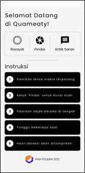
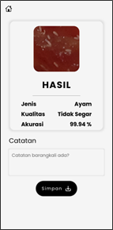
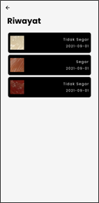
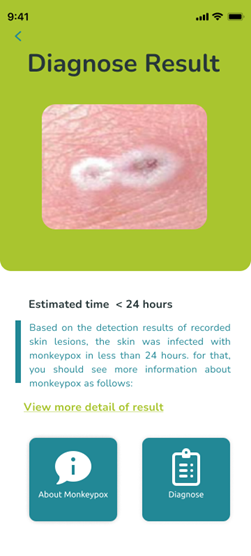
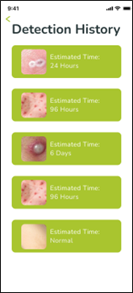

# 👋 Hi, I'm Abyan Ramzi  

## 👤 About Me
I’m a technology enthusiast passionate about **Building intelligent systems that connect things, data, and automation**.  
My focus is bridging **research and real-world implementation** — turning ideas into functional, data-driven systems.

- 🎓 **Background:** Telecommunication  
- 💼 **Experience:** Machine Learning, Computer Vision, & IoT  
- 🎯 **Looking for:** R&D / AI Engineer / Data-Centric roles  

---

## 🧠 Machine Learning & Computer Vision Projects

### 🔹 [DETECTRON2 + SORT Tracking for Retail Product Counting](https://github.com/abyanramzi/detectron2-retail-product-counting.git)
Developed as part of a **research and development initiative** to improve an existing client solution where **hand movements were mistakenly counted** as product transitions.  
Two main results were achieved:
1. ✅ **Accurate counting** of retail products moving across the line.  
2. 🚫 **No false detection** for hand movements near the line.

| Scenario | Example GIF |
|-----------|--------------|
| Product Counting |  |
| Hand Exclusion |  |

#### ⚙️ System Stack
Detectron2 | OpenCV | Kalman Filter | Hungarian Algorithm | Counting Logic  

---

### 🔹 [YOLOv7 + Thermal and RGB Camera for Poultry Counting and Classification](https://github.com/abyanramzi/yolov7-thermal-rgb-bird-detection.git)
This research focused on **counting the number of birds** and identifying their **species** using **YOLOv7** integrated with two camera types:
- **RGB Camera** — captures standard visual images  
- **Thermal Camera** — provides infrared imaging for low-light environments  

A **cage contour measurement technique** was introduced to classify cages based on obstacle density. Model performance was compared across both camera types.

| RGB Prediction | Thermal Prediction |
|----------------|-------------------|
|  |  |
|Actual condition includes 4 quails, 1 pigeon, and 5 lovebirds|Actual condition includes 8 quails|

#### ⚙️ System Stack
YOLOv7 | OpenCV | Streamlit | Thermal & RGB Cameras | Instance Segmentation  

---

## 📊 Data Analysis Projects

### 🔹 [Bank Transaction Fraud Detection Using K-Means Clustering](https://github.com/abyanramzi/bank-transaction-fraud-detection.git)
A case study analyzing **transaction frequency, amount, and behavioral patterns** to detect potential fraudulent activity using **unsupervised learning (K-Means Clustering)**.

| **Description** | **Preview** |
|------------------|-------------|
| Correlation Matrix |  |
| Behavior Scatter |  |
| K-Elbow Curve |  |
| PCA Clusters |  |

#### ⚙️ System Stack
Machine Learning | K-Means Clustering | Data Visualization | Python | EDA  

---

### 🔹 [Game Data Analysis for Business Improvement](https://github.com/abyanramzi/game-data-analysis.git)
🚧 *Coming Soon*

#### ⚙️ System Stack
ETL | PostgreSQL | Data Visualization | Data Analysis  

---

## 🧩 Research & Proposed Concepts

### 🔹 [Quameaty: Application for Meat Quality Detection](https://dx.doi.org/10.31544/jtera.v7.i1.2022.107-114)
Developed a mobile tool to detect **chicken meat quality** using image processing and **InceptionV3** model.  
The app, named **Quameaty**, classifies meat freshness directly from camera input.

| **Home** | **Detection Result** | **History** |
|-----------|----------------------|--------------|
|  |  |  |

#### ⚙️ System Stack
TensorFlow Lite | InceptionV3 | Flutter | Image Classification  

---

### 🔹 [PoxDiag: Application for Monkeypox Diagnosis](https://docs.google.com/presentation/d/161wSFoGKiW1TZ9xEfcEptZWjfWO7Nheu/edit?usp=sharing)
Proposed during the **National Scientific Writing Competition** at **Universitas Muhammadiyah Surakarta**, where it **won the competition**.  
The app diagnoses **monkeypox infection** based on lesion images using deep learning (InceptionV3).

| **Home** | **Detection Result** | **History** |
|-----------|----------------------|--------------|
|  |  |  |

#### ⚙️ System Stack
TensorFlow Lite | InceptionV3 | Kotlin | Image Classification  

---

> 🧭 *This repository serves as a curated gallery of my projects, research, and concepts across AI, Data, and IoT fields.*
